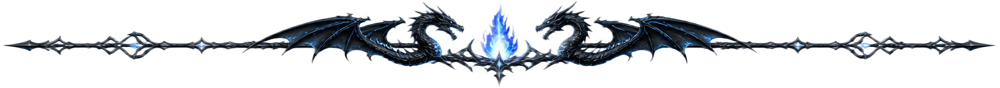
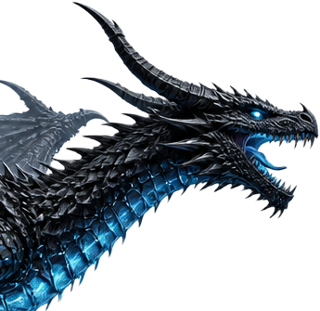

<div align="center">
  

<!-- ────────────────────────────────  TITLE  ──────────────────────────────── -->


**`SOFTWARE DEVELOPER`** · **`QA-MINDED BUILDER`** · **`WEB & APP DEVELOPER`** · **`TECH EXPLORER`**

<br />

> *“Code is just a tool… the real magic is what you build with it.”*

<br />

[](https://www.mostafa-taher.duckdns.org)
[](https://github.com/Mostafa-Taher-git)
[](https://www.linkedin.com/in/mostafa-taher-ahmed-59b60b318/)

`BUILD` ◆ `LEARN` ◆ `CREATE` ◆ `SHARE`


</div>

##  &nbsp;THE RIDER

I'm **Mostafa Taher**, a Computer & Artificial Intelligence graduate from **MTI University (2025)**, building practical software across development, testing, systems and the web.

I work where **software engineering meets problem solving**: shape an idea, turn it into a working product, test it, harden it, and learn from every failure along the way.

```text
◆ CURRENT FLIGHT PATH
├── 💻  Software Development
├── 🧪  Software Testing & QA
├── 🌐  Web Development
├── 🖥️  IT & Systems
├── 🤖  AI & Automation
└── 🎮  Game Development
```

> **Philosophy** — Understand the problem first. Build the solution second. Polish it until it feels right.

<div align="center"></div>

##  &nbsp;THE FORGE

<table>
<tr>
<td width="50%" valign="top">

### 🖥️ &nbsp;Applications
Desktop, web and mobile applications designed around real problems and real workflows.

</td>
<td width="50%" valign="top">

### 🧪 &nbsp;Quality & Testing
Manual testing, API testing, debugging and quality-focused development.

</td>
</tr>
<tr>
<td width="50%" valign="top">

### 🐧 &nbsp;Systems & Linux
Linux, system architecture, desktop environments and operating-system development.

</td>
<td width="50%" valign="top">

### 🤖 &nbsp;AI & Automation
AI-powered workflows, tools and automation that make software genuinely more useful.

</td>
</tr>
</table>

<div align="center"></div>

##  &nbsp;DRAGONS I HAVE RAISED

<table>
<tr>
<td width="50%" valign="top">

###  [LittleTech](https://github.com/Mostafa-Taher-git/LittleTech)
**Gamified troubleshooting learning platform, built with Flutter.**
14 troubleshooting worlds, 400+ procedural levels, boss battles, progression systems, local accounts and an offline-first architecture.

`Flutter` `Dart` `BLoC` `Isar` `Clean Architecture`

</td>
<td width="50%" valign="top">

### 🛡️ [OpsDesk](https://github.com/Mostafa-Taher-git/OpsDesk)
**Helpdesk / IT operations platform.**
IT support workflows turned into a structured software system — tickets, support operations and service-management concepts.

`Python` `IT Operations` `Helpdesk` `Support Systems`

</td>
</tr>
<tr>
<td width="50%" valign="top">

###  [FAM-OS](https://github.com/Mostafa-Taher-git/FAM-OS)
**AuraOS-CAMS — an AI-first Arch Linux distribution** focused on developers, performance and productivity. Going below the application layer.

`Linux` `Arch` `Shell` `System Design`

</td>
<td width="50%" valign="top">

### 🎮 [Tetris — C++](https://github.com/Mostafa-Taher-git/Tetris--c--)
A classic **Tetris built in C++** — game loops, collision, rendering and core programming from the ground up.

`C++` `Game Development`

</td>
</tr>
</table>

<div align="center"></div>

##  &nbsp;THE ARSENAL

<div align="center">

**LANGUAGES**


**WEB & APPLICATION**


**DATABASES & TOOLS**


**TESTING & ENGINEERING**


## THE DRAGON FEEDS


<br />

<a href="https://github.com/Mostafa-Taher-git">
  
</a>
<a href="https://github.com/Mostafa-Taher-git">
  
</a>

<br /><br />


</div>

##  &nbsp;CAREER FOCUS

I'm building my career around roles that combine **software development, troubleshooting, quality assurance and critical thinking**.

`Software Development` · `QA / Software Testing` · `IT / Technical Support` · `Web Development` · `Game Development`

<div align="center">


## ENTER MY WORLD

**🌎 [www.mostafa-taher.duckdns.org](https://www.mostafa-taher.duckdns.org)** &nbsp;·&nbsp; **🐙 [github.com/Mostafa-Taher-git](https://github.com/Mostafa-Taher-git)**

<br />

### THE DRAGON CODE

> **Build. Learn. Create. Share.**
>
> **I love technology.**
>
> ⚔️ **I AM THE SWORD.**

<br />


**🐉 Thanks for visiting.**

</div>
