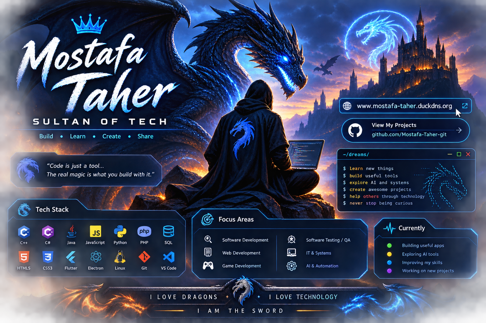
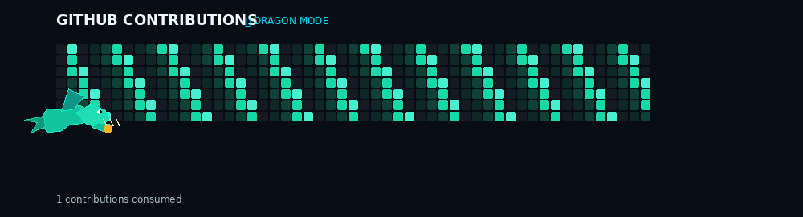

<div align="center">
  
</div>

<br />

<div align="center">

# 🐉 MOSTAFA TAHER

### SULTAN OF TECH

**Software Developer · QA-minded Builder · Web & App Developer · Tech Explorer**

> I build useful things, break them on purpose, fix them properly, and keep learning.

[🌐 Website](https://www.mostafa-taher.duckdns.org) · [💻 GitHub](https://github.com/Mostafa-Taher-git) · [🔗 LinkedIn](https://www.linkedin.com/in/mostafa-taher-ahmed-59b60b318/)

</div>

---

## ⚔️ About Me

I'm **Mostafa Taher**, a Computer & Artificial Intelligence graduate from **MTI University (2025)**, focused on building practical software across development, testing, systems, and the web.

I enjoy working where **software engineering meets problem solving**: designing an idea, turning it into a working product, testing it, improving it, and learning from every failure along the way.

My current direction is centered around:

- 💻 Software Development
- 🧪 Software Testing & QA
- 🌐 Web Development
- 🖥️ IT & Systems
- 🤖 AI & Automation
- 🎮 Game Development

> **My philosophy:** Understand the problem first. Build the solution second. Polish it until it feels right.

---

## 🐲 What I Build

<table>
<tr>
<td width="50%">

### 🖥️ Applications

Desktop, web and mobile applications designed around real problems and real workflows.

</td>
<td width="50%">

### 🧪 Quality & Testing

Manual testing, API testing, debugging and quality-focused development.

</td>
</tr>
<tr>
<td width="50%">

### 🐧 Systems & Linux

Exploring Linux, system architecture, desktop environments and operating-system development.

</td>
<td width="50%">

### 🤖 AI & Automation

Experimenting with AI-powered workflows, tools and automation that make software more useful.

</td>
</tr>
</table>

---

## 🔥 Featured Projects

### 🐉 [LittleTech](https://github.com/Mostafa-Taher-git/LittleTech)

**Gamified troubleshooting learning platform built with Flutter.**

A practical learning experience built around real-world IT troubleshooting. It includes **14 troubleshooting worlds, 400+ procedural levels, boss battles, progression systems, local accounts and an offline-first architecture**. citeturn343092view1

`Flutter` `Dart` `BLoC/Cubit` `Isar` `Clean Architecture`

---

### 🛡️ [OpsDesk](https://github.com/Mostafa-Taher-git/OpsDesk)

**Helpdesk / IT operations platform.**

A project focused on turning IT support workflows into a structured software system, with an emphasis on tickets, support operations and practical service-management concepts. citeturn343092view2

`Python` `IT Operations` `Helpdesk` `Support Systems`

---

### 🐲 [FAM-OS](https://github.com/Mostafa-Taher-git/FAM-OS)

**AuraOS-CAMS — an AI-first Arch Linux distribution focused on developers, performance and productivity.** citeturn343092view3

This project represents my interest in going below the application layer and exploring **Linux systems, distributions, developer tooling and desktop computing**.

`Linux` `Arch` `Shell` `System Design`

---

### 🎮 [Tetris — C++](https://github.com/Mostafa-Taher-git/Tetris--c--)

A classic **Tetris game built in C++**, representing my interest in game development and core programming. citeturn343092view4

`C++` `Game Development`

---

## 🛠️ Tech Arsenal

### Languages

<p>
  
</p>

### Web & Application Development

<p>
  
</p>

### Databases & Tools

<p>
  
</p>

### Testing & Engineering

`Manual Testing` · `API Testing` · `Debugging` · `QA` · `JIRA` · `Postman` · `Agile/Scrum`

---

## 🧠 Currently Exploring

```text
🐉 Software Engineering
├── Build better applications
├── Software Testing & QA
├── Linux & System Engineering
├── Web & Full-Stack Development
├── AI-assisted development
└── Game Development
```

---
<div align="center">

## 📊 GitHub Activity

<div align="center">


<br /><br />

<!-- Animated Quote -->


<br />

<!-- Dragon Contribution Animation -->



</div>

---

## 🎯 Career Focus

I'm building my career around roles where I can combine **software development, troubleshooting, quality assurance and systems thinking**.

I'm especially interested in opportunities involving:

`Software Development` · `QA / Software Testing` · `IT / Technical Support` · `Web Development` · `Systems` · `Game Development`

---

## 🌐 Enter My World

<div align="center">

### 🌎 Portfolio
**[www.mostafa-taher.duckdns.org](https://www.mostafa-taher.duckdns.org)**

### 🐙 GitHub
**[github.com/Mostafa-Taher-git](https://github.com/Mostafa-Taher-git)**

</div>

---

## 🐉 The Dragon Code

<div align="center">

> **Build. Learn. Create. Share.**
>
> **I love dragons. I love technology.**
>
> ⚔️ **I AM THE SWORD.**

</div>

---

<div align="center">


<br /><br />

**🐉 Thanks for visiting my profile. Keep building.**

</div>
